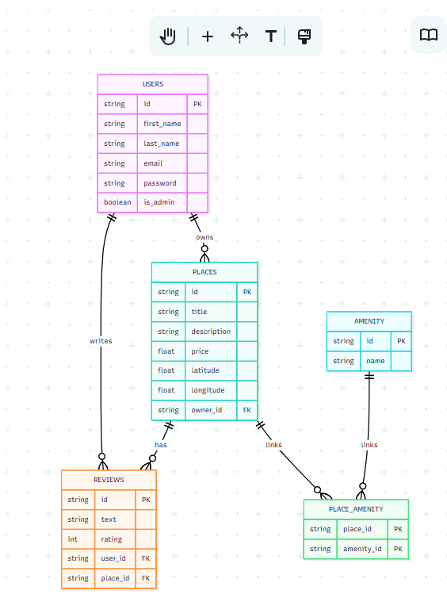

# HBnB – Part 3: Enhanced Backend with Authentication and Database Integration

This repository contains the third part of the HBnB project: a secure, database‑backed backend powered by Flask, SQLAlchemy, JWT authentication, and role‑based access control. In this stage you replace in‑memory storage with a persistent relational database, introduce user authentication and authorization, and produce a visual model of your schema with Mermaid.js.

---

## Table of Contents

1. [Features](#features)  
2. [Getting Started](#getting-started)  


---

## Features

- **JWT Authentication**  
  Secure login and token issuance with `flask-jwt-extended`.

- **Role‑Based Access Control**  
  Admin users (`is_admin`) can manage all resources; regular users can only modify their own.

- **SQLAlchemy Persistence**  
  SQLite in development, easily switchable to MySQL for production.

- **CRUD Endpoints**  
  Full create, read, update, and delete operations for Users, Places, Reviews, and Amenities.

- **Data Validation & Security**  
  Bcrypt password hashing, request payload validation, and proper HTTP status codes.

- **Schema Visualization**  
  ER diagram rendered for clear documentation of relationships.

## Entity Relationship Diagram




## Getting Started

### Prerequisites

- Python 3.8+  
- Virtual environment tool (venv, pipenv, etc.)  
- PostgreSQL or MySQL for production (SQLite is used by default)  
- Node.js (for Mermaid live preview, optional)

### Install Dependencies

```bash
git clone https://github.com/BrunoBarrera1/holbertonschool-hbnb.git
cd holbertonschool-hbnb/part3
python3 -m venv .venv
source .venv/bin/activate
pip install -r requirements.txt

Developed by Bruno Barrera & Juan Diego Martinez
